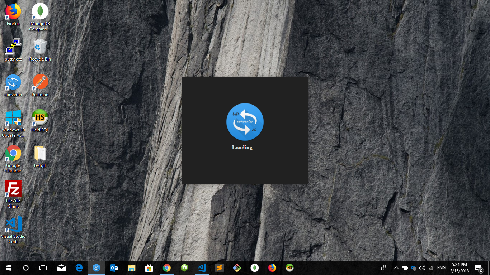
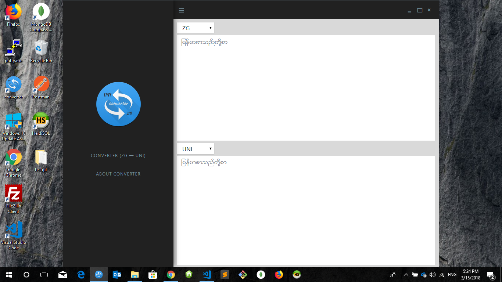
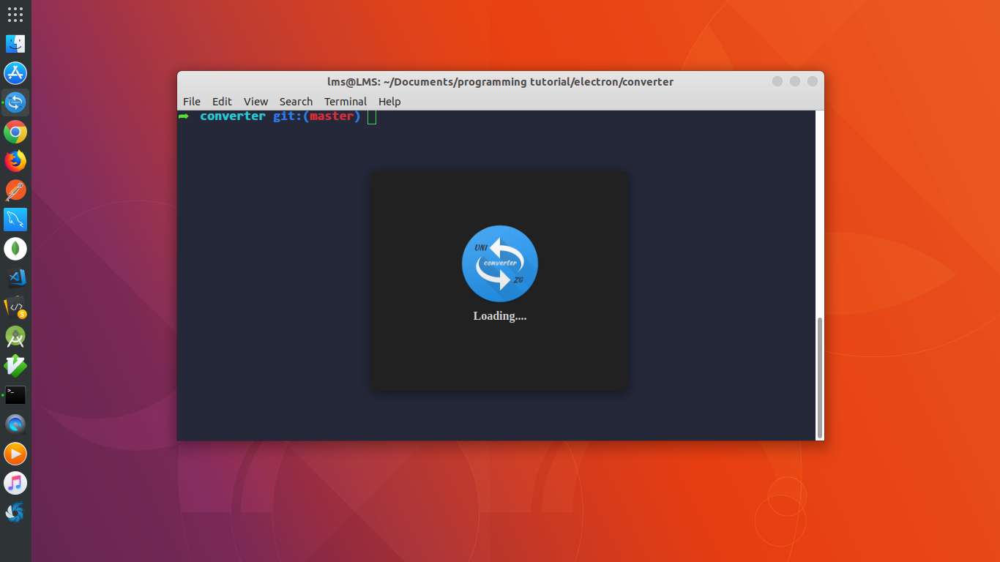
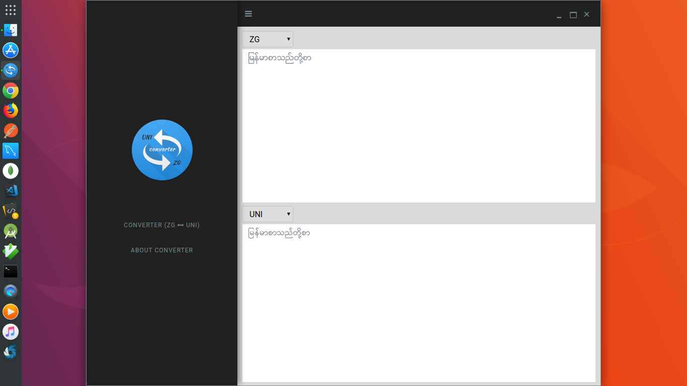

# Converter
This is converter for myanmar unicode to zawgyi or Zawgyi to Unicode.Ubuntu and window are supported.

    Added feature
    -splash screen

## Installation
First you have to install node and npm.If not install got to https://nodejs.org and install it.

1. clone the repository
1. goto project directory
1. run `npm install`
1. and then run `npm run package-linux`
1. finally run `npm run create-debian-installer`

### Debian installer
If you want to download  directly  debian installer.You can download [here](http://larmaysee.com/converter/converter_1.1.1_amd64.deb).

### Window installer
If you want to download directly window installer .You can download [here](http://larmaysee.com/converter/converter_1.1.1.exe);

#### Screenshot

    **Window

    **Ubuntu

#### Credit
1. Electron JS ( [www.electron.atom.io](https://electron.atom.io/) )
2. Node JS ( [www.nodejs.org](https://nodejs.org/en/) )
3. Rabbit Converter ( [www.rabbit-converter.org](http://www.rabbit-converter.org/Rabbit/) )
4. Knayi-Myscript ([Knayi Myscript](https://www.npmjs.com/package/knayi-myscript))

#### License
[MIT LICENSE](https://g.co/kgs/cvPzhD)

